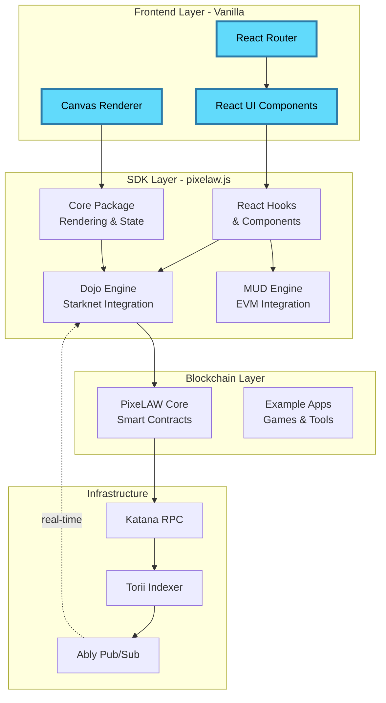

# Vanilla - PixeLAW Frontend

<div align="center">


[](https://github.com/pixelaw/vanilla)
[](https://react.dev)
[](https://vitejs.dev)
[](https://www.typescriptlang.org)

**Modern React frontend for interacting with the PixeLAW pixel-based autonomous world**

[Live Demo](https://demo.pixelaw.xyz) • [SDK](../pixelaw.js/) • [Core Contracts](../core/) • [Examples](../examples/)

</div>

---

## What is Vanilla?

**Vanilla** is the official React frontend client for PixeLAW, providing an intuitive interface for interacting with pixel-based games and applications on the blockchain. Built with modern web technologies, Vanilla offers a responsive canvas-based UI, real-time synchronization with blockchain state, and seamless wallet integration.

Whether you're placing pixels in a painting app, playing Snake, or interacting with complex multi-app experiences, Vanilla provides the visual interface and user experience layer that makes PixeLAW accessible and enjoyable.

**Key Capabilities**:
- **Canvas Rendering**: Smooth, performant pixel rendering with zoom and pan
- **Real-time Sync**: Live updates from blockchain via Torii indexer and Ably
- **Multi-Chain Support**: Works with both Dojo/Starknet and MUD/EVM backends
- **Wallet Integration**: Seamless connection with Cartridge Controller
- **App Switching**: Easy selection between multiple PixeLAW apps
- **Responsive Design**: Works on desktop and mobile devices

---

## Architecture

Vanilla sits at the top of the PixeLAW stack, connecting users to the blockchain through the SDK:



**Vanilla provides**:
- User interface components (GamePage, Settings, App/Color pickers)
- Canvas-based pixel rendering with interactions
- Wallet connection and account management
- World configuration (local, testnet, mainnet)

**Vanilla consumes**:
- **@pixelaw/core**: Base rendering engine and state management
- **@pixelaw/core-dojo**: Dojo/Starknet blockchain integration
- **@pixelaw/core-mud**: MUD/EVM blockchain integration
- **@pixelaw/react**: React hooks for state access
- **@pixelaw/react-dojo**: Dojo-specific React components

---

## Features

### 🎨 Canvas Rendering
- Smooth pixel rendering with hardware-accelerated canvas
- Zoom and pan with mouse wheel and touch gestures
- Inertia-based scrolling for natural feel
- Visual effects (glow, fade, text overlay)
- Efficient dirty rectangle rendering

### 🔄 Real-time Updates
- Live pixel updates via Torii indexer
- Ably pub/sub for instant notifications
- Optimistic UI updates for responsive feel
- Automatic synchronization with blockchain state

### 🌍 Multi-World Support
Multiple blockchain environments configured via `src/config/worlds.json`:
- **Local Development**: http://127.0.0.1:3000
- **Sepolia Testnet**: Sepolia test environment
- **Demo**: https://demo.pixelaw.xyz
- **Mainnet**: Production environment
- **Custom**: Configure your own worlds

### 🎮 App Integration
- App picker with icons and descriptions
- Seamless switching between Paint, Snake, and custom apps
- Dynamic parameter forms based on app manifests
- Transaction history and status tracking

### 💼 Wallet Management
- Cartridge Controller integration for Starknet
- Account switching for multi-account testing
- Secure key management
- Transaction signing with user confirmation

### 🎨 Color Tools
- Color palette selector
- Custom color picker with hex input
- Recent colors history
- RGB/HSL color modes

---

## Tech Stack

| Technology | Version | Purpose |
|-----------|---------|---------|
| **React** | 18.3.1 | UI framework with hooks and functional components |
| **Vite** | 6.3.5 | Build tool with fast HMR and optimized production builds |
| **TypeScript** | 5.8.3 | Type-safe JavaScript with excellent IDE support |
| **React Router** | 7.7.1 | Client-side routing for multi-page app |
| **Biome** | 2.1.3 | Fast linting and formatting (replaces ESLint + Prettier) |
| **Zustand** | (via pixelaw.js) | Lightweight state management |
| **Canvas API** | Native | High-performance pixel rendering |

### PixeLAW.JS Dependencies

Vanilla integrates all five pixelaw.js packages in workspace mode:

```json
{
    "@pixelaw/core": "workspace:*",           // Base rendering and state
    "@pixelaw/core-dojo": "workspace:*",      // Dojo blockchain integration
    "@pixelaw/core-mud": "workspace:*",       // MUD blockchain integration
    "@pixelaw/react": "workspace:*",          // React hooks and components
    "@pixelaw/react-dojo": "workspace:*"      // Dojo-specific React components
}
```

---

## Quick Start

### Prerequisites
- **Node.js**: 24 or higher
- **pnpm**: 10.14.0 or higher
- **Running PixeLAW Core**: Docker image or local development setup

### Installation

```bash
cd vanilla

# Install dependencies
pnpm install

# Start development server
pnpm dev

# Visit http://127.0.0.1:5173/
```

### Using Justfile Commands

The `justfile` provides convenient development commands:

```bash
# Interactive dev: shows logs AND saves to dev.log
just dev

# Background dev: logs to dev.log only
just dev_bg

# Stop background dev server
just dev_stop

# Follow dev.log in real-time
just dev_logs

# Docker commands
just docker_run       # Start containers
just docker_logs      # View container logs
just docker_shell     # Access pixelaw-core container
```

### Workspace vs Regular Mode

Vanilla supports two dependency modes:

**Workspace Mode** (default, for development):
Uses local pixelaw.js packages via path aliases in `vite.config.ts`. Changes to SDK packages reflect immediately.

**Regular Mode** (for production):
Uses published npm packages. Switch with:

```bash
# Switch to regular mode (npm packages)
pnpm use-regular

# Switch back to workspace mode (local packages)
pnpm use-workspace
```

---

## Project Structure

```
vanilla/
├── src/
│   ├── index.tsx                  # App entry point with engine initialization
│   ├── Main.tsx                   # Main routing component
│   ├── index.css                  # Global styles
│   │
│   ├── pages/                     # Page components
│   │   ├── GamePage/              # Main game interface
│   │   │   ├── GamePage.tsx
│   │   │   └── GamePage.module.css
│   │   ├── SettingsPage.tsx       # User settings
│   │   ├── WalletSelectorPage.tsx # Wallet connection
│   │   └── WorldSelectorPage.tsx  # Blockchain world selector
│   │
│   ├── components/                # Reusable components
│   │   ├── CustomButton/          # Styled button component
│   │   ├── GamePage/              # Game UI components
│   │   │   ├── AppPickerButton/   # App selection UI
│   │   │   ├── ColorPickerButton/ # Color selection UI
│   │   │   └── WalletPickerButton/# Wallet UI
│   │   ├── Loading/               # Loading spinner
│   │   ├── MenuBar/               # Navigation menu
│   │   └── NotificationPanel/     # Notification display
│   │
│   ├── config/
│   │   └── worlds.json            # World configuration registry
│   │
│   ├── lib/                       # Utility libraries
│   └── utils/                     # Helper functions
│
├── public/                        # Static assets (icons, images)
│
├── package.json                   # Dependencies and scripts
├── vite.config.ts                 # Vite configuration with workspace switching
├── biome.json                     # Code formatting (4-space, double quotes, 120 char width)
├── tsconfig.json                  # TypeScript configuration
├── docker-compose.yml             # Docker development setup
├── Dockerfile                     # Multi-stage production build
├── justfile                       # Task runner commands
└── index.html                     # HTML entry point
```

---

## Development Guide

### Development Server

```bash
# Standard way
pnpm dev

# With justfile (recommended)
just dev          # Interactive with console output
just dev_bg       # Background mode
just dev_logs     # Follow logs
just dev_stop     # Stop background server
```

The dev server starts at http://127.0.0.1:5173/ with:
- Hot Module Replacement (HMR) for instant updates
- TypeScript type checking
- Source maps for debugging

### Building for Production

```bash
# Build optimized bundle
pnpm build

# Preview production build
pnpm preview

# Build output is in dist/
```

Production build includes:
- Code splitting for optimal loading
- Tree shaking to remove unused code
- Minification and compression
- Asset optimization

### Docker Development

```bash
# Build Docker image
docker build -t pixelaw-vanilla:latest .

# Run with docker-compose
just docker_run

# Or manually
docker compose up -d

# Access shell in running container
just docker_shell

# View logs
just docker_logs

# Stop containers
docker compose down
```

The Dockerfile uses a multi-stage build:
1. **Base stage**: Install pnpm
2. **Prod deps stage**: Install production dependencies
3. **Build stage**: Build the application
4. **Core stage**: FROM ghcr.io/pixelaw/core (includes blockchain)
5. **Final stage**: Copy built frontend to core container

Result: Single container with both frontend and blockchain.

### Code Quality

```bash
# Run Biome linter
pnpm lint

# Format code
pnpm format

# Check types
pnpm type-check
```

**Biome Configuration** (biome.json):
- **Indentation**: 4 spaces
- **Quotes**: Double quotes
- **Line Width**: 120 characters
- **Semicolons**: Required

### Testing

```bash
# Run tests (when configured)
pnpm test

# Run tests in watch mode
pnpm test:watch
```

---

## Configuration

### World Configuration (`src/config/worlds.json`)

Define multiple blockchain environments:

```json
{
    "worlds": [
        {
            "name": "Local",
            "rpcUrl": "http://127.0.0.1:3000",
            "toriiUrl": "http://127.0.0.1:3000",
            "relayUrl": "ws://127.0.0.1:3000"
        },
        {
            "name": "Demo",
            "rpcUrl": "https://demo.pixelaw.xyz",
            "toriiUrl": "https://demo.pixelaw.xyz",
            "relayUrl": "wss://demo.pixelaw.xyz"
        }
    ]
}
```

Users can select worlds from the World Selector page.

### Environment Variables

Create `.env` file for local development:

```bash
# API Keys
VITE_ABLY_API_KEY=your_ably_key

# Feature Flags
VITE_ENABLE_DEBUG=true
```

### Vite Configuration

`vite.config.ts` handles workspace vs regular mode:

```typescript
export default defineConfig(({ mode }) => {
    const useWorkspace = mode === 'development';

    return {
        resolve: {
            alias: useWorkspace ? {
                '@pixelaw/core': path.resolve(__dirname, '../pixelaw.js/packages/core/src'),
                '@pixelaw/core-dojo': path.resolve(__dirname, '../pixelaw.js/packages/core-dojo/src'),
                // ... other workspace packages
            } : {}
        }
    };
});
```

---

## Usage Examples

### Connecting to a World

```typescript
// src/index.tsx
import { PixelawCore } from '@pixelaw/core';
import { Engines } from '@pixelaw/core';

const core = PixelawCore.getInstance();

await core.init({
    engineType: Engines.DOJO,
    dojoConfig: {
        rpcUrl: 'http://localhost:5050',
        toriiUrl: 'http://localhost:8080',
        relayUrl: 'ws://localhost:9090',
        manifest: manifest,
    },
    renderConfig: {
        canvas: canvasElement,
        center: { x: 0, y: 0 },
        zoom: 1,
    }
});
```

### Using React Hooks

```typescript
import { usePixelawProvider } from '@pixelaw/react';

function MyComponent() {
    const { pixelawCore, coreStatus, app, setApp, color, setColor } = usePixelawProvider();

    // Access pixel store
    const pixel = await pixelawCore.pixelStore.getPixel({ x: 0, y: 0 });

    // Listen to events
    useEffect(() => {
        const handler = (coord) => console.log('Pixel clicked:', coord);
        pixelawCore.events.on('pixelClick', handler);
        return () => pixelawCore.events.off('pixelClick', handler);
    }, []);

    return <div>Status: {coreStatus}</div>;
}
```

### Interacting with Pixels

```typescript
// Prepare interaction
const interaction = await pixelawCore.engine.prepInteraction({ x: 10, y: 10 });

// Modify parameters
interaction.params.color = '#FF0000';

// Execute
await interaction.execute();
```

---

## Contributing

We welcome contributions to make Vanilla better! Here's how you can help.

### Code Style

Follow the Biome configuration:

```javascript
// ✅ Good
function updatePixel(position: Position, color: string): void {
    const pixel = getPixel(position);
    if (pixel) {
        pixel.color = color;
    }
}

// ❌ Bad (wrong indentation, single quotes)
function updatePixel(position: Position, color: string): void {
  const pixel = getPixel(position);
  if (pixel) {
    pixel.color = color;
  }
}
```

**Conventions**:
- **Indentation**: 4 spaces (NOT tabs)
- **Quotes**: Double quotes for strings
- **Line Length**: Max 120 characters
- **Semicolons**: Always required
- **Components**: PascalCase (e.g., `GamePage`, `ColorPicker`)
- **Functions**: camelCase (e.g., `handleClick`, `formatColor`)
- **Files**: Match component name (e.g., `GamePage.tsx`, `GamePage.module.css`)

### Component Patterns

**Functional Components with Hooks**:
```typescript
interface MyComponentProps {
    title: string;
    onAction: () => void;
}

export function MyComponent({ title, onAction }: MyComponentProps) {
    const [state, setState] = useState<string>("");

    useEffect(() => {
        // Side effects here
    }, []);

    return (
        <div>
            <h1>{title}</h1>
            <button onClick={onAction}>Action</button>
        </div>
    );
}
```

**CSS Modules**:
```typescript
// MyComponent.module.css
import styles from "./MyComponent.module.css";

export function MyComponent() {
    return <div className={styles.container}>Content</div>;
}
```

### Testing (when tests are added)

```typescript
import { render, screen, fireEvent } from '@testing-library/react';
import { MyComponent } from './MyComponent';

describe('MyComponent', () => {
    it('renders with title', () => {
        render(<MyComponent title="Test" onAction={() => {}} />);
        expect(screen.getByText('Test')).toBeInTheDocument();
    });

    it('calls onAction when button clicked', () => {
        const mockAction = vi.fn();
        render(<MyComponent title="Test" onAction={mockAction} />);
        fireEvent.click(screen.getByText('Action'));
        expect(mockAction).toHaveBeenCalled();
    });
});
```

### Pull Request Process

1. **Fork the repository** and create your branch from `main`
2. **Make your changes** following code style guidelines
3. **Test locally**: Run `pnpm dev` and verify functionality
4. **Run linter**: `pnpm lint` must pass
5. **Build successfully**: `pnpm build` must complete without errors
6. **Create a PR** with:
   - Clear description of changes
   - Screenshots for UI changes
   - Link to any related issues

### Development Workflow

```bash
# 1. Fork and clone
git clone https://github.com/YOUR_USERNAME/vanilla
cd vanilla

# 2. Install dependencies
pnpm install

# 3. Create feature branch
git checkout -b feature/my-new-feature

# 4. Make changes and test
just dev          # Start dev server
# Make changes, see live updates

# 5. Check code quality
pnpm lint
pnpm build

# 6. Commit and push
git add .
git commit -m "feat: add my new feature"
git push origin feature/my-new-feature

# 7. Open PR on GitHub
```

### What to Contribute

We're especially interested in:

- **UI/UX improvements**: Better layouts, animations, accessibility
- **Performance optimizations**: Faster rendering, smaller bundles
- **New features**: Additional tools, better controls, enhanced visualizations
- **Bug fixes**: Issues labeled `bug` in GitHub
- **Documentation**: README updates, code comments, user guides
- **Mobile support**: Responsive design improvements

---

## Version Compatibility

| Component | Version | Notes |
|-----------|---------|-------|
| **Vanilla** | `0.7.11` | Current frontend version |
| **React** | `18.3.1` | UI framework |
| **Vite** | `6.3.5` | Build tool |
| **TypeScript** | `5.8.3` | Type system |
| **Node.js** | `24` | Runtime (Docker image uses node:24-slim) |
| **pnpm** | `10.14.0` | Package manager |
| **@pixelaw/core** | `0.8.0` | SDK core package |
| **@pixelaw/core-dojo** | `0.8.0` | Dojo integration |
| **@pixelaw/react** | `0.8.0` | React hooks |

---

## Troubleshooting

### Common Issues

**Issue**: `Cannot find module '@pixelaw/core'`
```bash
# Solution: Ensure you're in workspace mode
pnpm use-workspace
pnpm install
```

**Issue**: Canvas not rendering
```bash
# Solution: Check that Core is running
docker compose up -d
# Verify at http://localhost:5050 (Katana) and http://localhost:8080 (Torii)
```

**Issue**: Hot reload not working
```bash
# Solution: Restart dev server
just dev_stop
just dev
```

**Issue**: Build fails with TypeScript errors
```bash
# Solution: Clear cache and rebuild
rm -rf node_modules .vite
pnpm install
pnpm build
```

### Performance Tips

1. **Use workspace mode only in development** - Production should use regular mode with published packages
2. **Limit canvas render area** - Zooming in reduces pixels to render
3. **Clear browser cache** - Old service workers can cause issues
4. **Use Chrome DevTools Performance tab** - Profile rendering bottlenecks

---

## Resources

### Documentation
- **PixeLAW Book**: [pixelaw.github.io/book](https://pixelaw.github.io/book/index.html)
- **React Docs**: [react.dev](https://react.dev)
- **Vite Docs**: [vitejs.dev](https://vitejs.dev)
- **TypeScript Docs**: [typescriptlang.org](https://www.typescriptlang.org)

### Related Repositories
- **Core Contracts**: [../core/](../core/) - PixeLAW smart contracts
- **SDK (pixelaw.js)**: [../pixelaw.js/](../pixelaw.js/) - TypeScript SDK
- **Examples**: [../examples/](../examples/) - Example game apps

### Community
- **Discord**: [Join PixeLAW Discord](https://t.co/jKDjNbFdZ5)
- **Twitter**: [@0xpixelaw](https://x.com/0xpixelaw)
- **GitHub Issues**: [Report bugs or request features](https://github.com/pixelaw/vanilla/issues)

---

## License

This project is licensed under the MIT License - see the [LICENSE](LICENSE) file for details.

---

<div align="center">

**Built with ❤️ by the PixeLAW community**

[🎮 Try PixeLAW](https://demo.pixelaw.xyz) • [📖 Read the Docs](https://pixelaw.github.io/book) • [💬 Join Discord](https://t.co/jKDjNbFdZ5)

</div>
